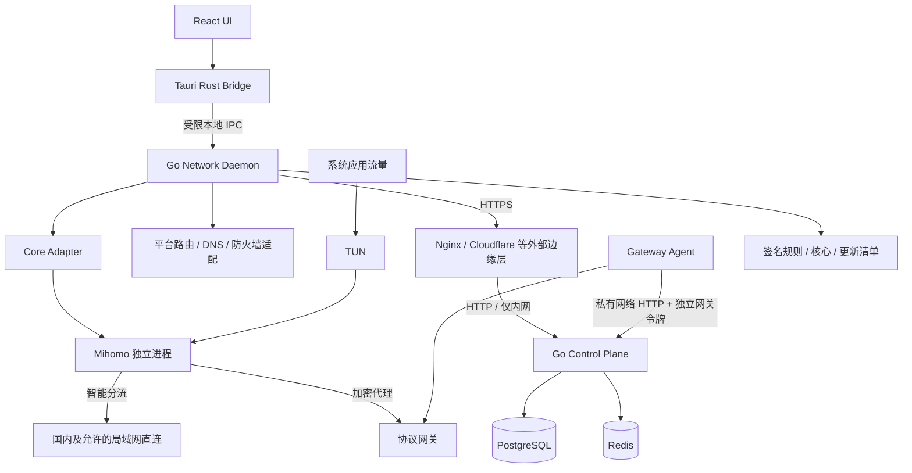

# Lightflow 技术方案

版本：v0.1  
日期：2026-10-06  
需求依据：[REQUIREMENT.md](./REQUIREMENT.md) v0.2  
状态：开发前设计草案；架构决策已提出，平台能力及协议授权机制仍需 M0 原型验证。

> **MVP 范围（2026-10-08）**：本文件保留原 V1 蓝图供后续参考，不代表当前交付范围。当前目标是邀请制 Windows 内测：现有 Hysteria2 连接，UDP 不通时回退 VLESS-Reality，完成智能/全局模式与断开后的网络恢复。服务端执行基线见 [服务端 MVP 重新设计](docs/SERVER_MVP_REDESIGN.md)；客户端设计由客户端工作区写入 `docs/client/`。各章下方的“MVP 状态”优先于尚未更新的 V1 正文。`TECHNICAL_DESIGN.md` 仅由服务端工作区修改，仓库文件归属见 [AGENTS.md](AGENTS.md)。

## 1. 方案结论与适用范围

**MVP 状态：**Windows 邀请制内测；服务端采用现有邮箱密码、PostgreSQL、单候选和 Hysteria2，另补 VLESS-Reality TCP 回退。Redis、多平台和完整 V1 矩阵后置。

采用 **Tauri 2 + React + TypeScript 桌面端、Go 本地网络服务、独立 Mihomo 核心进程、Go 云端控制面、PostgreSQL + Redis**。桌面端不以管理员身份运行；安装器负责安装需要权限的网络服务。系统流量通过 TUN 接管，不能把设置系统 HTTP/SOCKS 代理当作完整 VPN 实现。

UI 只提交国家、网络模式及连接意图。本地服务负责授权、连接状态机、服务器及协议选择、路由、DNS、重连和恢复；核心负责协议与流量转发。控制面负责账户、订阅、设备、连接租约和策略，服务器侧必须真正执行凭据过期、吊销及并发限制。

本文合并覆盖需求第 31 节要求的 Architecture、Desktop、Daemon、Control Plane、Networking、Routing、DNS、Core Integration、Security、Update、Database、API、Testing、Release 共十四项设计。进入开发后可按模块拆分，本文保留总体决策及验收基线。

V1 覆盖 Windows、macOS、Linux 完整连接闭环，包含账户、设备、智能/全局/直连模式、协议回退、重连、Kill Switch、托盘及三类更新。不扩展移动端、自定义节点、配置导入、脚本和用户高级规则。套餐支付与商业订单系统不在现有需求范围内；首版通过管理后台配置权益，并保留支付系统接入接口。

当前目录只有需求文档，没有可复用实现。本文所有数值均为工程初始值或验收目标，不代表实测结果；M0/M2 的测量结果用于校准。

## 2. 总体架构与职责

**MVP 状态：**服务端控制面与 Hysteria2 Agent 已实现；Windows 客户端尚在原型阶段。Redis 与 Artifact Service 不进入 MVP；服务端新增工作见独立执行基线。



| 模块 | 职责 | 边界 |
| --- | --- | --- |
| Desktop | 登录交互、国家列表、状态、设置、托盘、诊断展示 | 不接触节点秘密，不生成核心配置，不直接改网络 |
| Tauri Bridge | 受限命令、IPC 客户端、系统凭据存储入口 | 不提供任意 shell、任意文件或任意 URL 执行 |
| Daemon | 连接协调、设备身份、授权续租、平台适配、恢复、核心管理 | 只接受有版本的类型化业务命令 |
| Core Adapter | 业务配置转换、能力检测、启动/停止/检查/统计 | Mihomo YAML 和管理 API 不泄露至业务层 |
| Platform Adapter | 网卡、路由、DNS、防火墙、网络事件、安装集成 | 操作归属可追踪、幂等、可恢复 |
| Control Plane | 账户权益、目录、策略、授权、发布元数据 | 不转发用户业务流量 |
| Gateway / Agent | 协议终止、实时授权、连接限制、健康与负载 | 不采集访问域名、URL 或内容 |
| Artifact Service | 规则、核心、客户端及签名清单分发 | 不承载授权凭据 |

控制面首版采用模块化单体，API 和异步 Worker 可分别部署，共享 Go 业务包。网关按国家独立部署。先使用容器、数据库迁移和对象存储/CDN，不把 Kubernetes 或微服务拆分设为前置条件。

## 3. 技术选型与版本策略

**MVP 状态：**PostgreSQL 是唯一服务端状态存储；Redis、对象存储/CDN 和通用 OpenTelemetry 平台后置。客户端技术选型由 `docs/client/` 维护。

| 层级 | 选择 | 原因与约束 |
| --- | --- | --- |
| 桌面 | Tauri 2、React、TypeScript、Vite | 共享交互；Rust Bridge 是桌面壳必需部分 |
| UI 数据 | TanStack Query + 小型 UI store | 远端查询和界面状态分开；连接状态以 Daemon 为准 |
| 本地服务 | Go | 复用状态机、网络协调、控制面客户端；平台代码隔离 |
| 核心 | Mihomo 独立可执行文件 | 优先符合需求；固定版本与配置兼容矩阵 |
| 控制面 | Go、HTTP JSON、OpenAPI 3.1 | 客户端契约清晰，便于生成类型和模拟服务 |
| 数据 | PostgreSQL、Redis | PG 为权益与租约事实来源；Redis 用于缓存、限流和协调 |
| 分发 | S3 兼容对象存储 + CDN | 独立发布规则、核心、客户端，保留上一可用版本 |
| 运维 | Prometheus / OpenTelemetry | 仅服务性能和运行结果；避免采集用户流量元数据 |

锁定实际依赖版本、核心二进制哈希、Go/Rust 工具链与前端 lockfile；M1 冻结经 CI 验证的版本，不在方案中依赖“始终使用最新版”。

Mihomo 仓库提供 GPL v3 许可证文本。分发前应核验选定版本的许可证、修改内容、源码交付及第三方依赖要求；采用进程隔离不等于自动免除许可证义务。商业分发方式在 M0 形成记录，不能未经评估便嵌入核心库。[来源：Mihomo LICENSE](https://github.com/MetaCubeX/mihomo/blob/Meta/LICENSE)

## 4. Desktop Architecture

**MVP 状态：**客户端归属章节；MVP 采用现有邮箱密码而非 OIDC，Windows 实施细节由 `docs/client/` 给出。

页面划分为登录、首页、国家、账户/设备、设置、诊断、关于/更新。首页展示产品状态与国家；服务器 ID、协议参数、原始核心错误仅保留在内部。

- 首次启动检查网络服务安装、版本兼容与权限；安装失败提供具体修复入口。
- 登录建议采用 OIDC Authorization Code + PKCE，在系统浏览器完成；身份服务可选成熟 OIDC 实现。通过系统回调或受限 loopback 回调接收结果，校验 state/nonce。没有自建密码认证的必要。
- Daemon 持有短期访问令牌和设备身份；刷新令牌由桌面凭据模块保存在 Windows Credential Manager、macOS Keychain、Linux Secret Service。Daemon 续期通过经过认证的 Bridge 获取必要令牌，不保存用户密码。
- Linux 无 Secret Service 时禁用持久登录，不能静默回退到明文文件。没有 UI 且令牌无法刷新时，只保持有效租约，期限届满停止连接；无人值守长期登录另行设计。
- 关闭窗口默认隐藏到托盘，Daemon 及连接继续运行；“退出”根据后台运行设置决定只退出 UI 或同时断开。严格 Kill Switch 的封锁状态必须始终可见。
- 自动连接需要已授权设备、可用身份会话、有效订阅及就绪服务；不能绕过登录和系统授权。
- 对页面启用 CSP 与最小 Tauri capabilities，远程网页不得获得本地命令权限。白名单命令为 get_status、connect、disconnect、update_settings、list_devices、export_diagnostics 等。[来源：Tauri Capabilities](https://v2.tauri.app/security/capabilities/)

## 5. Daemon Design 与本地 IPC

**MVP 状态：**客户端归属章节；优先 Windows Service 与受限 IPC 原型，macOS/Linux 留待 V1。

Windows 使用 Windows Service；macOS 使用 launchd 特权 helper；Linux 使用 systemd 服务。服务独立于 UI 生命周期，支持启动时恢复和核心崩溃监控。

服务内包含 IPC Server、Session Manager、Connection Controller、Selector、Core Manager、Network Manager、Rule Manager、Update Manager、Diagnostics。网络修改、连接切换、更新应用统一由单一操作队列串行执行，后台下载和探测可并行。

### 5.1 IPC 安全与契约

Windows 使用 Named Pipe，macOS/Linux 使用 Unix Domain Socket；生产不暴露无鉴权 localhost HTTP 管理入口。

- 安装阶段登记允许的操作系统用户；服务验证 Named Pipe 客户端身份或 Unix peer credentials。
- Unix socket 置于不可被普通用户替换的父目录，并设置精确权限；Named Pipe 禁止远程访问并限制 ACL。
- IPC 握手核验协议版本、用户身份、会话随机数；命令绑定已注册设备和当前控制用户。
- 同一台计算机只有一个全局活动 VPN。其他 OS 用户不能继承当前账户的连接控制权；注销/用户切换按明确策略断开，V1 不做多人共享隧道。
- 只接受类型化字段及有限枚举，不接受任意路径、核心配置、命令行或脚本。配置和下载目录由服务决定，拒绝路径穿越及符号链接替换。
- 核心管理端口仅限本地并使用随机密钥和平台访问控制；需验证普通本地进程无法绕过 Daemon 操作核心。HTTP 密钥不能写入进程参数或普通日志。

请求示意：

```json
{
  "api_version": 1,
  "request_id": "uuid",
  "method": "connect",
  "params": { "country_code": "JP", "mode": "smart", "transport_preference": "auto" }
}
```

connect 返回 operation_id；请求超时不表示连接已取消。客户端可查询操作结果，重复 request_id 返回相同结果。事件包含 sequence、operation_id、state、country_code、error_code；事件断流后先重新读取完整快照，UI 不自行推断连接状态。

### 5.2 连接状态机

```text
Disconnected → Authorizing → Preparing → Connecting → Verifying → Connected
Connected → Reconnecting → Preparing / Connecting → Verifying → Connected
任意活动状态 → Disconnecting → Disconnected
不可恢复错误 → Recovering → Failed
严格封锁但没有隧道 → Blocked
```

Authorizing/Preparing/Connecting/Verifying 在 UI 合并为“正在连接”；Recovering 根据连接意图显示“正在重新连接”或“连接失败”；Blocked 显示“未连接，网络保护已开启”。

Connected 的条件为核心存活、路由/DNS 已应用、通过指定候选隧道访问自有 HTTPS 探测站成功、出口国家符合目录配置。仅核心启动或 TCP 握手成功不算连接成功。

每次连接生成 generation；用户断开、换国家或注销提升 generation，取消旧授权、探测及重试，防止旧异步结果重新接管网络。断开命令幂等，清理完再发布 Disconnected；清理失败显示恢复错误。

## 6. Networking Design：三平台接管

**MVP 状态：**客户端归属章节；先验证 Windows Mihomo TUN/auto-route/strict-route，不在 MVP 自行重写三平台路由管理。

Mihomo 文档提供 TUN、自动路由及平台相关选项。方案采用 Daemon 管理系统路由/DNS/防火墙，核心仅拥有 TUN 和转发；优先关闭核心自动路由/自动重定向，避免双重修改。能否完全分离及相应配置必须在 M0 验证，不能直接假定三平台一致。[来源：Mihomo TUN](https://wiki.metacubex.one/en/config/inbound/tun/)

| 平台 | V1 接管与恢复 | Kill Switch | 发布与风险 |
| --- | --- | --- | --- |
| Windows | 核心 TUN/Wintun、服务调用系统路由与网卡 DNS API | WFP 过滤策略 | 安装器提升权限；驱动、服务、二进制签名与卸载恢复 |
| macOS | 官网分发，launchd helper + 核心 utun；路由与 DNS 使用系统接口 | 专属 PF anchor，持久策略及恢复工具 | Developer ID 签名、公证；睡眠、网络服务切换、PF 能力须原型验证 |
| Linux | /dev/net/tun、netlink 路由；systemd-resolved D-Bus 优先，NetworkManager 集成 | 独立 nftables table/chain | systemd 系统先支持；不能假设任意发行版 DNS 管理相同 |

Wintun 是 Windows 三层 TUN 驱动；WFP 提供网络过滤能力，具体捕获与保护策略由平台适配器实现。[来源：Wintun](https://www.wintun.net/)、[Microsoft WFP](https://learn.microsoft.com/en-us/windows/win32/fwp/windows-filtering-platform-start-page)

Linux nftables 提供规则管理机制，方案仅修改专属表，不清空用户防火墙。[来源：nftables](https://www.netfilter.org/projects/nftables/index.html)

macOS Network Extension 作为后续系统 VPN 集成路线，不能把外部 Mihomo 进程直接等同于 Packet Tunnel Provider。采用该路线需要原生扩展、核心嵌入/数据通道改造和 entitlement；M0 若证明 helper 路线无法满足稳定性或严格封锁，则必须重做 macOS 适配设计，不能静默降低需求。[来源：Apple Network Extension Entitlement](https://developer.apple.com/documentation/bundleresources/entitlements/com.apple.developer.networking.networkextension)

建议首轮验证 Windows 11 x64、macOS 14+ arm64/x64、Ubuntu 24.04 LTS x64。它们是拟定测试基线，仍需验证依赖和用户覆盖；不宣称所有 Windows/macOS/Linux 版本均受支持。Linux 首版不支持无 systemd、无法管理 DNS 的环境；安装前给出支持性检查。

### 6.1 数据通路、环路与 IPv6

- 接管应用 TCP/UDP，智能直连也经过核心做规则决策；核心出站绑定当前物理接口，网关端点设置明确的逃逸路径，避免隧道套入自身。
- 控制面 bootstrap、租约续期和网关连接使用服务身份受限的物理出站规则；例外仅覆盖规定地址、端口及进程/套接字，不能把整台机器设为白名单。
- DNS 与探测在隧道建立前需有专门 bootstrap 通路；候选探测通过隔离代理入口完成，不为每次候选试连切换整机路由。
- V1 必须实现 IPv4/IPv6 双栈或在受保护会话期间明确阻断未接管 IPv6；不得只取消 AAAA 解析而允许硬编码 IPv6 绕行。连接前不修改整机永久 IPv6 设置。
- 非 TCP/UDP（如 ICMP）支持程度单独验证；不支持的受保护流量应阻断并在诊断中说明，不直接放行。
- 初始 MTU 采用经平台测试的保守值，覆盖 PMTU、UDP 大包及 QUIC；不写死“某 MTU 永远可用”。

### 6.2 网络变更事务与崩溃恢复

服务保存受限权限的 write-ahead journal：transaction_id、阶段、网卡身份、原 DNS、原路由、防火墙归属、期望连接状态，不保存凭据。

连接顺序：预检/检查租约 → 落盘恢复记录 → 按 Kill Switch 设置保护 → 启动核心及 TUN → 核心就绪 → 应用路由/DNS → 隧道验证 → 提交事务 → 发布 Connected。

断开顺序：取消重试 → 保持必要封锁 → 撤销受控 DNS 和路由 → 停止核心/TUN → 释放租约 → 根据保护模式恢复防火墙 → 删除已完成 journal。遇到中间失败按反序补偿，严格模式保留封锁。

启动时检查未提交 journal、残留接口及专属规则，只撤销本产品拥有的修改；恢复 DNS 时比较当前值，尊重期间发生的 DHCP、系统或其他软件变更，不能覆盖整张旧快照。Wi-Fi 已变化时基于当前活动接口恢复。卸载器执行相同清理，严格模式卸载需明确解除保护；提供签名恢复工具处理服务无法启动的情况。

## 7. Routing Design 与网络模式

**MVP 状态：**客户端归属章节；Windows 先实现智能、全局、直连，规则配置以原型实测为准。

同一版本规则模型供核心配置、DNS 策略及封锁决策使用。国家选择只改变代理出口，不改变分流规则。

智能模式优先级：

1. 回环、必要系统链路控制及服务 bootstrap 特例。
2. 用户允许的局域网目的地址 DIRECT；关闭局域网访问则拒绝应用访问 LAN，不影响必要 DHCP/ARP/NDP。
3. 经审核的中国大陆域名规则 DIRECT，匹配后不被其 CDN 海外 IP 覆盖。
4. 经审核的中国大陆 IPv4/IPv6 CIDR DIRECT。
5. 其余流量 PROXY；无法判断时默认 PROXY，不能默认直连。

全局模式跳过国内域名/IP 直连，所有互联网流量 PROXY；LAN 仍由单独设置决定。直连模式等同主动结束 VPN 会话并恢复系统 DNS/路由，不申请网关租约；UI 显示“未受 VPN 保护”。从严格模式进入直连必须显式提示并解除严格封锁，不能后台自动切换。

规则不依据 .cn 后缀单独判断。国内域名、CIDR、LAN、产品必要端点分别维护；数据来源、许可、误匹配与 IPv6 覆盖在规则构建流程中审核。保留版本、来源版本、schema_version、哈希及签名，原子替换并支持回滚。

## 8. DNS Design

**MVP 状态：**客户端归属章节；先验证 Windows fake-ip 与 DNS 劫持，无泄漏证据由 Windows 原型提供。

首版优先采用核心内置 DNS 与 fake-ip 模式，由 Daemon 生成配置。Mihomo 提供 fake-ip/redir-host 和 IPv6 DNS 设置；兼容性问题通过受控 fake-ip-filter 处理，而非让用户编辑 DNS。[来源：Mihomo DNS](https://wiki.metacubex.one/en/config/dns/)

| 查询类型 | 智能模式 | 全局模式 |
| --- | --- | --- |
| 允许的 LAN / 本地域名 | 原网络解析器，链路本地范围 | 同左 |
| 已知国内域名 | 指定国内 DoH，明确 DIRECT 出站 | 隧道内 DoH |
| 其他域名 | 隧道内 DoH，失败不切到公网明文 DNS | 隧道内 DoH |
| 控制面 / 网关 bootstrap | 固定信任配置与受限直连解析 | 同左，作为连接必要例外 |

系统 DNS 指向受控本地解析入口，并劫持/阻断应用绕过的 TCP/UDP 53；DNS 劫持不能替代全部系统 DNS 管理。国内 DNS 的 DIRECT 路径是智能模式的预期行为，不应宣传为“所有 DNS 均经过 VPN”。

使用 fake-ip 保存域名与连接的映射，避免先用未知 IP 决定域名归属。fake-ip 地址池检测与现有网段冲突；连接期间禁止清空活跃映射，恢复时需考虑应用 DNS 缓存仍持有 fake-ip，执行可用的系统缓存刷新并验证应用重试。策略更新不混用两个规则版本的 DNS 和路由。

应用自带 DoH/DoT 不可假定能被完全拦截或识别。其流量仍被 TUN 接管：已知国内解析服务按规则直连，其余按默认隧道处理；因缺少域名映射造成的分流差异属于已知边界，未知目标仍走代理。V1 不实施 TLS 中间人解密，也不承诺覆盖任意应用加密 DNS 的域名识别。

连接前优先使用随包签名 bootstrap 配置和可验证 TLS 的备用控制面端点；bootstrap 解析不能依赖尚未建立的隧道。禁止关闭 TLS 校验。非国内受保护 DNS 在隧道断开期间由 Kill Switch 一同阻断。

## 9. Proxy Core Integration Design

**MVP 状态：**客户端归属章节；MVP 只对接 Hysteria2 与 VLESS-Reality，其他协议待需求变更确认后进入 V1/P2。

定义与核心无关的 DesiredConnection、Endpoint、RoutingPolicy、DNSPolicy、CoreCapabilities、CoreStatus。业务包不引用 Mihomo 配置类型。

```go
type CoreAdapter interface {
    Capabilities(ctx context.Context) (CoreCapabilities, error)
    Validate(ctx context.Context, plan CorePlan) error
    Start(ctx context.Context, plan CorePlan) (CoreHandle, error)
    Probe(ctx context.Context, handle CoreHandle) (ProbeResult, error)
    Stop(ctx context.Context, handle CoreHandle) error
}
```

能力包含协议及版本、UDP、IPv6、DNS 模式、TUN、热更新、独立路由控制。新核心通过同一契约测试，不要求所有核心拥有相同特性；缺失必需能力时拒绝计划，不静默降级。

配置由服务本地生成、结构校验、调用锁定核心的配置检查后再启动；优先内存传递，如核心必须读文件则使用管理员专属临时目录、限制权限、停止后删除并禁用敏感 crash dump。核心二进制来自已验证的安装/更新目录，不能从用户可写路径启动。

### 9.1 协议语义与上线矩阵

QUIC 是传输方向，不单独作为节点协议；“QUIC 优先”首版映射至 Hysteria2 等已实现的 QUIC 协议，“TCP 优先”映射至 VLESS/Trojan 等 TCP 入口。Reality 是安全/握手组合参数，首版使用 VLESS + Reality，不与 VLESS 并列为独立拨号器。Mihomo VLESS 文档列有相关配置。[来源：Mihomo VLESS](https://wiki.metacubex.one/en/config/proxies/vless/)

| 需求能力 | 客户端接入 | 服务器与凭据要求 | 发布条件 |
| --- | --- | --- | --- |
| Hysteria2 / QUIC | Mihomo Hysteria2 adapter | 网关支持动态认证与活动会话回收 | M2 首条 QUIC 连接链路 |
| VLESS / Reality | VLESS + Reality adapter | 动态用户同步、到期删除、现存连接关闭 | M2 TCP 回退链路 |
| Trojan | Trojan adapter | 每租约凭据、过期执行、会话回收 | V1 协议兼容测试通过 |
| VMess | VMess adapter | 每租约身份、服务器动态更新、会话回收 | V1 协议兼容测试通过 |
| Snell | Snell adapter | 核验服务端版本、授权动态化及撤销能力 | M0 探索；未验证不得标记支持 |

Mihomo 提供 Snell 配置，但客户端可拨号不代表服务器能执行临时授权或热撤销。[来源：Mihomo Snell](https://wiki.metacubex.one/en/config/proxies/snell/)

需求第 11 节列出的全部首期协议保留在 V1 验收矩阵中。为降低开发风险先打通 Hysteria2 与 VLESS + Reality，其他协议在 M5 前完成；若 Snell 等无法满足授权机制或分发条件，形成明确需求变更后才能调整范围，不能把“两种协议可用”当作全部需求完成。

## 10. Control Plane Design 与服务器健康

**MVP 状态：**邮箱密码、PG、单候选和最低负载选择已实现；多区域评分/健康 Worker 后置。服务端先向 Windows 提供可用测试环境。

模块包括 Identity、Entitlement、Device、Catalog、Session、Selection、Policy、Artifact、Admin、Health Worker。管理后台独立鉴权、管理员 MFA、角色权限及审计；客户端不能调用管理员接口。

当前 Gateway Agent 通过私有网络 HTTP + 每网关独立令牌拉取授权快照并回报就绪状态；控制面只存令牌摘要，内部端口默认不映射宿主机。未来多地区部署需要加密私网或外部边缘层终止 HTTPS，不让应用进程承载 HTTPS。CPU、带宽及握手失败率上报属于后续健康能力。健康 Worker 从多个区域执行端到端探测；单纯 ping 不代表协议可用。初始心跳 15 秒、主动探测 30 秒，连续 3 次失败进入隔离；恢复需连续成功且经过冷却期。

客户端在后端预筛的最多 3 个候选上做限速、短超时的真实协议探测。不探测全部节点；不按某个用户访问内容判断质量。客户端上报连接结果属于可关闭的产品遥测，服务器运行健康不依赖该遥测。

选择先过滤订阅权限、国家、可用协议、核心能力、节点健康、负载上限及客户端版本。初始评分：成功率 35%、稳定性 25%、延迟 20%、容量余量 20%，所有因子归一化；超时和离线候选直接剔除。新节点使用保守先验，小样本不能获得虚高评分。

快速连接在可用国家集合内评分，近期成功国家可加有限偏好；手动国家连接仅在该国内切换服务器和协议，不能静默切换国家。连续失败进入候选冷却，恢复后分批重新引流。评分权重、协议顺序及超时通过有版本的签名策略发布，客户端本地限制最大重试数和最短超时。

## 11. 临时连接授权与设备限制

**MVP 状态：**Hysteria2 的租约、ACK、踢线保持原样；VLESS-Reality 先做 3 天限时 PoC，撤销延迟以实测和需求变更记录为准。

连接授权不是“后台返回一段带 expires_at 的静态配置”。服务器必须验证、过期并切断现存连接，否则凭据实际仍可永久使用。

1. 客户端以随机设备 ID 和设备密钥注册；不使用 MAC 地址、硬件序列号作为强绑定依据。
2. Daemon 请求连接租约，提交国家/自动、模式、能力、设备证明及幂等键。
3. 控制面验证身份、设备状态、订阅、设备上限和同时连接上限；PG 事务锁定账户额度并预留一个逻辑会话名额。
4. 选择有限候选，为每个入口生成独立租约凭据。Agent 安装授权并回 ACK 后才返回可用计划；失败的预留会释放。
5. Daemon 验证 plan_id、lease_id、expires_at、schema/version 和设备绑定，内部生成核心配置。
6. 探测和连接共用一个逻辑会话名额，但限制候选授权数量与短期重叠窗口。客户端选定后回报激活入口，撤销其他候选。
7. 初始租约寿命 10 分钟、每 3 分钟续租；绝不超过订阅到期时间。服务器采用自身时钟，客户端使用单调计时估算剩余期限。
8. 续租失败可使用现有授权直到截止，不能无限离线续期；新连接必须在线授权。Agent 控制通道失联也不得超出租约期限继续服务。
9. 设备删除、注销、订阅撤销触发撤销事件；Agent 删除认证并回收相关活动流。租约过期由服务器本地定时执行，即使控制面不可用。

Hysteria2 官方服务器配置包含 HTTP 认证能力，可作为每租约认证的接入点；活动连接踢除仍需单独实现和验证，不能假定认证回调会周期性重新验证既有连接。[来源：Hysteria2 Server Config](https://v2.hysteria.network/docs/advanced/Full-Server-Config/)

VLESS/VMess/Trojan 由 Gateway Adapter 将租约转为独立身份并同步网关用户集合。若服务端无法关闭现存流，可采用可控网关实现或增加会话回收机制；单纯删除用户只阻止新握手，不满足快速吊销要求。

设备密钥能证明设备身份，但不能阻止设备所有者从内存提取实际协议秘密。服务器仍需 enforce 每租约连接额度和设备账户限制；不能宣称本地加密可以杜绝共享。

初始撤销目标：在线 Agent 收到撤销后 60 秒内结束对应会话；控制通道不可用时最多持续至当前租约到期。V1 应明确向运营展示这一最坏延迟。

## 12. 自动重连与 Kill Switch

**MVP 状态：**客户端归属章节；Windows MVP 只做 Kill Switch 开/关，自动重连依客户端原型验证。

### 12.1 重连

订阅 OS 网络变化和 Sleep/Wake 事件，变化后 1 秒去抖；暂停旧探测，重新识别活动网卡、物理出口、DNS 和网关地址，更新服务例外后重连。退避初始为 1/2/4/8 秒，之后封顶 30 秒并加抖动；离线时等网络恢复，不反复消耗授权。

UDP/QUIC 阻断时优先回退 TCP。单次尝试初始超时 8 秒，整轮最多 3 个候选，总预算 30 秒；诊断结果可提前淘汰不支持的传输。已有候选全部失败时重新获取计划。自动重连不突破用户国家约束，不复用过期凭据。

核心崩溃先保护网络再重启；反复崩溃进入失败状态并保留保护。用户主动断开、注销、设备撤销或订阅到期立即取消重连。

### 12.2 保护语义

| 模式 | 非预期断线/重连中 | 用户主动断开 | 服务崩溃/重启 |
| --- | --- | --- | --- |
| 关闭 | 尽快恢复系统网络，可出现直连 | 恢复系统网络 | 启动恢复工具清理残留 |
| 标准（默认） | 阻断本应代理的流量，保留明确允许的 DIRECT | 清理保护并恢复网络 | 有连接意图时维持保护，重启服务后重连 |
| 严格 | 除有限系统及连接必要例外，所有互联网流量必须经隧道 | 保持封锁，用户明确解除后恢复 | 持久封锁，重启后先加载策略再尝试连接 |

严格模式覆盖智能模式中的国内 DIRECT，UI 说明“严格保护时国内流量也通过 VPN”；LAN 仍按单独设置决定。这样避免将国内直连与严格防漏的语义混合。

标准模式不能简单对整个核心进程放行任意出站：要区分核心 DIRECT 与代理隧道 socket，限制物理出口的 DIRECT 目的集合，防止 PROXY 流量在故障时退化直连。域名规则对应 IP 允许集合须与 DNS 映射同步，TTL 到期清理；不能识别或无法安全映射的连接宁可阻断。M0 必须验证平台对 socket/进程及目的集合的隔离可实现；若核心无法提供必要出站区分，需要专门 egress broker 或更改适配，不能用宽泛进程白名单宣称实现标准保护。

保护规则应先于路由切换生效，切换国家、模式及核心更新期间也维持封锁。标准模式规则需在 Daemon 崩溃时继续有效；严格模式还要验证重启后到服务启动前的窗口，无法做到则不能验收“严格”。提供明确解除按钮和签名恢复工具，避免只能通过手改防火墙恢复。

## 13. Database Design

**MVP 状态：**仅 PostgreSQL；现有事务配额和幂等会话保留，VLESS 只做向后兼容的协议字段迁移。Redis、outbox、KMS 后置。

| 表 | 核心字段及约束 |
| --- | --- |
| users | id、identity_subject 唯一、status、created_at |
| plans | id、code 唯一、device_limit、concurrent_limit、feature_flags |
| subscriptions | id、user_id、plan_id、status、starts_at、expires_at；权益查询索引 |
| devices | id、user_id、public_key、os、name、status、last_seen_at；不存硬件指纹 |
| countries | code 主键、display_name、enabled、sort_order |
| servers | id、country_code、region、status、capacity、agent_identity |
| endpoints | id、server_id、protocol、transport、host、port、public_params、capabilities |
| connection_sessions | id、user_id、device_id、state、active_endpoint_id、expires_at、revoked_at |
| endpoint_grants | id、session_id、endpoint_id、credential_ref、expires_at、state、agent_ack_at |
| session_idempotency | user_id、idempotency_key 唯一、request_hash、session_id、expires_at |
| policies | id、version 唯一、schema_version、content_hash、signature、rollout |
| artifacts | id、kind、version、os、arch、hash、signature、compatibility、status |
| health_snapshots | server_id、endpoint_id、window_start、aggregate_metrics；分区/限期删除 |
| audit_events | id、actor、action、resource_id、result、created_at；不含秘密 |
| outbox_events | id、aggregate_id、event_type、payload、published_at |

租约状态为 reserved、issued、active、released、expired、revoked；reserved 超时自动释放。锁定账户行后在同一 PG 事务中核算未过期活动/预留会话，确保多实例不会突破并发上限。Redis 不可用时回到 PG 正确性路径或拒绝新授权，不能 fail-open。

Redis 保存目录缓存、限流计数、短期健康评分和事件通知。设备删除、订阅修改及租约撤销通过事务 outbox 推送 Agent，可重试、可去重。Agent 保持已应用的授权版本并定期 reconciliation，避免事件丢失造成永久授权。

协议秘密使用 KMS/密钥封装加密，凭据摘要用于校验；public_params 不包含私钥。核心所需明文只出现在授权响应和受限运行环境，不在 API trace、审计、Redis 通用缓存中出现。备份加密并定期恢复验证。

## 14. API Design

**MVP 状态：**现有 API 契约见 `docs/API.md`；VLESS 接入时由服务端补单候选字段和“协议回退”顺序、错误码及样例，保持 Hysteria2 客户端兼容。

外部用户访问 `/v1` 应由独立 Nginx/Cloudflare 等边缘层提供 HTTPS，应用服务只监听内网 HTTP；客户端使用身份访问令牌，设备敏感操作增加设备证明。认证端点由 OIDC 服务负责，控制面验证 issuer、audience、期限和设备状态。

| 方法与路径 | 用途与主要响应 |
| --- | --- |
| GET /v1/me | 账户与订阅权益：expires_at、device_limit、concurrent_limit |
| GET /v1/countries | 用户可用国家列表，不向 UI 返回节点细节 |
| POST /v1/devices | 登记设备公钥，原子执行设备数量限制 |
| GET /v1/devices | 当前账户设备列表 |
| DELETE /v1/devices/{id} | 删除设备并异步撤销所有关联租约 |
| POST /v1/connection-sessions | 幂等创建租约，返回内部连接计划 |
| POST /v1/connection-sessions/{id}/activate | 标记成功候选并回收其他授权 |
| POST /v1/connection-sessions/{id}/renew | 重新检查权益后续租 |
| DELETE /v1/connection-sessions/{id} | 幂等释放/撤销会话 |
| GET /v1/policies/current | 签名选择策略及兼容版本 |
| GET /v1/artifacts/manifest | 指定平台/架构/channel 的签名更新清单 |
| POST /v1/telemetry/connection-results | 可关闭的聚合连接结果 |

内部授权响应示意（只进入 Daemon，不进入前端）：

```json
{
  "schema_version": 1,
  "plan_id": "plan_uuid",
  "lease_id": "session_uuid",
  "device_id": "device_uuid",
  "expires_at": "2026-10-06T10:10:00Z",
  "country_code": "JP",
  "policy_version": "policy_001",
  "rule_version": "rules_001",
  "candidates": [
    {
      "grant_id": "grant_uuid",
      "endpoint_id": "endpoint_uuid",
      "protocol": "hysteria2",
      "transport": "quic",
      "host": "gateway.example.invalid",
      "port": 443,
      "credential": "<ephemeral-secret>",
      "public_params": { "server_name": "gateway.example.invalid" }
    }
  ]
}
```

连接请求使用 Idempotency-Key，相同键不同请求体返回冲突。所有资源校验账户归属，不能凭 session_id 越权。国家和清单支持 ETag；敏感响应 Cache-Control: no-store，不通过公开 CDN 缓存。

错误统一为 code、message_key、request_id、retryable、retry_after。至少定义 AUTH_EXPIRED、SUBSCRIPTION_INACTIVE、DEVICE_LIMIT、CONCURRENT_LIMIT、NO_CAPACITY、NO_COMPATIBLE_ENDPOINT、LEASE_EXPIRED、DAEMON_UNAVAILABLE、NETWORK_PERMISSION_DENIED、DNS_APPLY_FAILED、RECOVERY_FAILED。401/403 不盲目重试，429 遵循 Retry-After，5xx 指数退避。

## 15. Security Design 与隐私

**MVP 状态：**保留设备 Ed25519、令牌轮换、私网 Agent 令牌和外部 HTTPS；RBAC/MFA、平滑密钥轮换及通用遥测后置。

主要威胁为本地 IPC 被滥用、UI 注入造成提权、核心/规则供应链篡改、连接凭据泄漏、订阅绕过、撤销遗漏和系统网络残留。

- 普通 UI、受限 IPC、特权服务、核心进程之间保持可审计边界；核心只获得所需网络权限。无法去除的特权作为明确风险评估。
- 安装目录和更新目录禁止普通用户写入，执行前验证发布签名和哈希；不信任远程配置中的任意可执行指令。
- TLS 校验始终启用；控制面备用地址来自受信签名配置。证书轮换先发布兼容版本，不依赖无法轮换的单一 pin。
- 服务/网关身份密钥、更新签名密钥与规则签名密钥分离；生产私钥使用 KMS/HSM 或受保护 CI secret，不能进入仓库。
- 默认日志只保留操作 ID、状态、错误码、版本和时间；去除账号令牌、节点密码、DNS 名称、完整 URL、目标 IP 和核心配置。核心原始连接日志默认关闭。
- 产品遥测可关闭，关闭后不上传国家/协议/连接结果等使用数据。权益校验、设备管理及租约续期是必需业务请求，在隐私说明中单独解释。
- 本地日志建议按 7 天或 20 MB 滚动；健康聚合建议保留 30 天，租约运营记录建议 7 天，管理员审计建议 90 天。均为初始工程值，正式上线按实际业务和隐私要求确定。
- 诊断包先本地脱敏并显示包含项，由用户主动导出；不自动上传。凭据泄漏时必须撤销租约和身份，不只清理日志。

## 16. Update Design

**MVP 状态：**客户端先用现成更新机制，服务端已有签名文档接口冻结扩展；独立制品和多层签名更新留待 V1。

客户端、核心、规则使用独立版本号和兼容矩阵，发布清单至少包含 kind、version、schema_version、platform、arch、size、hash、signature、min_daemon_version、min_core_version、channel 和 rollout。

| 类型 | 下载和验证 | 应用时机 | 失败处理 |
| --- | --- | --- | --- |
| 客户端 | Tauri updater 签名 + 系统安装包签名 | 提示重启；涉及服务升级先安全断开 | 安装器保留兼容恢复路径，不能只依赖 UI 更新 |
| 核心 | Daemon 校验独立签名、哈希、架构和许可包 | 下载可后台进行，切换默认等断开；必要时保持封锁 | 配置检查/探测失败回退上一核心 |
| 规则 | 签名、schema 校验、测试样本与版本兼容 | 网络事务队列原子应用，DNS/路由同步版本 | 回退 last-known-good，继续使用现有规则 |

Tauri updater 要求更新签名；它不替代 Go 特权服务、驱动和规则的安全更新流程。[来源：Tauri Updater](https://v2.tauri.app/plugin/updater/)

清单包含签名时间与有效期，并防止非授权降级；允许由专门签名的 rollback manifest 回滚有缺陷版本。轮换密钥采用旧信任链验证新密钥，保留离线根密钥恢复方案。

新版本先下载到隔离目录，验证后切换 active 指针，保留 previous；禁止覆盖正在运行的二进制。服务更新由签名安装器或独立 updater 完成，执行权限及 UI/Daemon IPC 兼容单独校验。更新状态也写入 journal，断电后恢复可用版本。

连接不中断时不承诺核心无缝热升级；更新规则失败不影响正在工作的规则。默认采用内测→小比例→扩大→全量灰度，有错误率阈值和暂停发布入口。

## 17. 日志、诊断与故障定位

**MVP 状态：**服务端只保留授权延迟、租约数量和网关健康等最小指标；客户端崩溃上报不新建控制面平台。

诊断执行分层检查：物理网络/门户认证 → 外部边缘层 TLS → 服务权限及 IPC → QUIC/TCP 候选协议 → 核心存活 → TUN/路由 → DNS → 隧道出口。检测结果返回稳定错误码和用户可执行的动作。

公共 Wi-Fi 门户环境显示需先完成网络登录；严格模式不会自动解除保护。诊断自身使用允许的测试地址，不读取浏览器历史或 DNS 查询历史。为区分用户本地故障和平台故障，管理侧监控授权延迟、Agent 同步延迟、活跃租约、网关握手及探测结果，不收集用户目标站点。

## 18. Testing Strategy 与验收

**MVP 状态：**Windows 单平台端到端闭环为验收门槛；容器健康和服务端单测不能替代 UDP 阻断回退、撤销及断开恢复实测。

业务单元测试覆盖状态机取消/乱序、评分、能力过滤、租约期限、并发配额、规则优先级和脱敏。契约测试覆盖 IPC/OpenAPI/schema、核心配置生成、Agent 授权 ACK 与重复撤销。网络与权限相关行为必须在真实 OS 或有相应能力的 VM 上验证，不能只用 mock 判定通过。

| 场景 | 通过条件 |
| --- | --- |
| 安装/登录/订阅 | 普通用户完成闭环；失效订阅、新设备超限、同时连接超限均被服务器拒绝 |
| 快速及国家连接 | 可用候选自动连接；手选国家不会自动变为其他国家；UI 不显示节点参数 |
| 智能分流 | 固定测试集覆盖国内域名、海外域名、国内 IP、海外 IP、LAN、IPv6；在两侧抓包确认路径 |
| DNS | 验证 UDP/TCP 53、自带 DoH、bootstrap、fake-ip 缓存及异常；受保护查询不会直连公网 DNS |
| 协议 | 每个 V1 协议验证握手、TCP/UDP 能力、断开、过期、吊销、网络受限下回退 |
| 自动重连 | Wi-Fi 切换、IP 变化、网卡关闭、sleep/wake、QUIC 阻断后恢复；取消操作后不得重连 |
| Kill Switch | 核心/服务强杀、路由切换、续租失败、重启等情况下持续抓包；受保护流量零绕行 |
| 网络恢复 | 正常断开、崩溃、更新失败、卸载后清理产品修改；不破坏原 DNS/路由/用户防火墙 |
| 租约安全 | 并发请求不超额，撤销切断现存连接，离线 Agent 在到期后拒绝连接 |
| 更新 | 错架构、坏签名、下载中断、断电、配置不兼容和回滚都保留可用版本 |
| 隐私/本地安全 | 日志无敏感数据；遥测关闭生效；普通进程无法访问 IPC/核心秘密或执行任意命令 |

初始性能/稳定性目标：正常受控测试网络下连接耗时 P95 ≤ 15 秒，网络恢复后重连 P95 ≤ 30 秒；控制面授权 API P95 ≤ 500 ms（不含客户端网络及网关授权同步）；正常断开后网络恢复 ≤ 5 秒；每个平台进行 100 次连接/断开循环及 24 小时运行测试。这些目标需记录设备规格、网络条件和样本量，不能用单次成功代替验收。

至少覆盖 NAT、IPv4-only、双栈、UDP 阻断、丢包/高延迟、DNS 故障、控制面断网、网关失联、多个网卡及其他 VPN 冲突。其他 VPN 已接管时拒绝连接并提示冲突，不自动删除其他产品配置。

发布门禁为 Windows PASS、macOS PASS、Linux PASS，且安全/恢复/授权测试全部通过。严格 Kill Switch 与临时授权不能仅依据 UI 显示或配置字段验收。

## 19. Release Strategy 与项目组织

**MVP 状态：**先邀请制 Windows 内测，macOS/Linux 和商业化发布流程留待 V1。

建议 monorepo：

```text
apps/desktop/             React / TypeScript
apps/desktop/src-tauri/   Rust Bridge、平台桌面集成
cmd/nimbus-daemon/        本地 Go 服务入口
cmd/control-plane/       控制面入口
cmd/gateway-agent/       网关 Agent 入口
internal/daemon/          状态机、连接与更新协调
internal/platform/        windows / darwin / linux
internal/core/            接口、mihomo adapter
internal/controlplane/    账户、权益、目录、租约、管理
internal/gateway/         协议授权及会话回收 adapter
contracts/                OpenAPI、IPC schema、事件模型
migrations/               PG schema 与版本迁移
rules/                    数据来源、规则构建、测试样本
packaging/                三平台安装、服务注册及恢复工具
deploy/                   开发及生产部署描述
tests/                    集成、故障注入、平台 E2E
docs/                     后续拆分的模块设计与决策记录
```

Go 模块按桌面服务和控制面共享契约组织，但不将服务器私钥或管理员逻辑打包到客户端。前端只依赖生成的产品契约，不依赖 internal/core。

CI 进行 Go/Rust/TypeScript 静态检查、业务/契约测试、核心配置验证、依赖扫描及 SBOM；各平台 runner 构建安装包。真实网络测试使用专用签名测试构建和隔离网关。生产签名仅在受保护发布流水线执行。

Windows 使用签名安装器部署桌面端、服务与所需驱动；macOS 使用签名并公证的 app/安装包及 helper；Linux 首版提供 deb/rpm 安装服务，AppImage 单独不能替代特权服务安装。包管理器安装的 Linux 客户端升级遵循包管理器，独立安装渠道才采用对应 updater。

数据库迁移遵循先兼容扩展、后迁移、再清理；上线 API 至少兼容当前和上一客户端代际。发布记录包括所有制品版本、哈希、签名、规则及协议兼容矩阵和恢复步骤。

## 20. 开发阶段与交付门禁

**MVP 状态：**本节旧 M0–M7 为 V1 蓝图；服务端执行 S0 供货、S1 VLESS PoC、S2 接入/联调、S3 第二国家节点，详见服务端 MVP 设计。

| 阶段 | 主要交付 | 退出条件 |
| --- | --- | --- |
| M0 技术设计及原型 | 本文、ADR、三平台 TUN/DNS/防火墙恢复原型、服务器凭据授权 PoC、许可记录 | 关键风险逐项有实证；不把文档完成视为验证完成 |
| M1 项目骨架 | UI、Daemon、控制面、Agent、契约、开发环境、CI | 安装/IPC/服务生命周期和接口模拟可运行 |
| M2 基础连接 | Hysteria2、VLESS + Reality、连接事务、测试网关 | 三平台连接/断开/恢复通过，凭据过期与吊销有效 |
| M3 智能分流 | 域名/CIDR、DNS、双栈策略、三种模式 | 测试集与抓包验证一致，无未接管路径 |
| M4 Control Plane | 登录、订阅、设备、国家、租约、管理、Agent 同步 | 并发限制、撤销、控制面故障场景通过 |
| M5 产品体验 | 自动选择/回退、设置、托盘、其余首期协议 | 端到端用户流程可用，首期协议矩阵完整 |
| M6 稳定性 | 重连、Sleep/Wake、Kill Switch、崩溃恢复 | 三平台故障注入、循环及长时间测试通过 |
| M7 发布能力 | 三类更新、签名安装、灰度、监控、恢复工具 | 三平台发布门禁全部通过 |

M2 可用模拟控制面开发，但服务器临时授权原型必须先完成；M3 的网络保护接口预留于 M2，不能到 M6 才重新定义流量边界。规则更新和候选健康是基础连接可靠性的依赖，尽管 PRD 列为 P1，其最小实现应提前进入 M3/M4。

## 21. 待验证决策与主要风险

**MVP 状态：**优先验证 Windows 网络原型、VLESS 现存流撤销上界、跨机 WireGuard 和边缘层 `Date` 头；其余风险按 V1 排队。

| 项目 | 本文推荐 | 必须完成的验证/决策 |
| --- | --- | --- |
| macOS 接管 | 首版官网分发 helper + utun | 路由/DNS 恢复、PF 严格封锁、签名安装；失败则评估 Network Extension |
| 标准 Kill Switch | 只允许确定的 DIRECT 与服务必要出口 | 核心 socket 隔离、域名 IP 集合同步及崩溃保护能力 |
| 严格重启保护 | 持久规则 + 先保护后联网 | 每个平台重启窗口抓包，不能仅测服务已启动状态 |
| Snell 等授权 | 保留需求，逐协议验证 | 动态身份、到期、现存连接吊销、服务端分发条件 |
| 核心路由归属 | Daemon 管理、核心关闭 auto-route | 固定版本是否支持完整分离，若不支持需明确归属及恢复契约 |
| 身份与套餐 | OIDC + 控制面权益 | 身份提供方、运营权益来源、设备/并发套餐配置 |
| 支持平台 | 明确限定版本/架构 | 三平台测试基线及真实用户覆盖，Linux DNS 管理组合 |
| 许可与规则来源 | 锁定版本、可审计制品 | 核心、驱动、服务端和规则数据的分发要求 |

这些项目前可按推荐方向推进原型，不需要为了例行实现选择中断工作。但在验证失败、需要降低需求或改变支持范围时，必须先修订技术方案/需求记录。进入正式开发的依据应是“设计 + 风险验证结果”，进入发布的依据应是三平台完整用户闭环和故障恢复证据。

## 部署边界修订（2026-10-06）

**MVP 状态：**继续有效：应用不终止公网 HTTPS，Nginx/Cloudflare 负责边缘层；协议网关按各自协议处理加密握手，Agent 控制接口只走受控私网。

根据部署要求，应用仓库不再内置 Caddy，也不在 Go 应用进程中终止 HTTPS。公开 API 默认只在宿主机回环地址提供 HTTP；公网 HTTPS 由独立的 Nginx/Cloudflare 层负责。网关控制接口默认仅在 Compose 网络可达，采用每网关独立令牌认证。跨主机部署必须放在加密私网内，或经外部 TLS 终止层接入，不得把令牌在公网明文传输。Hysteria2 协议本身仍需 TLS 证书完成加密握手。
