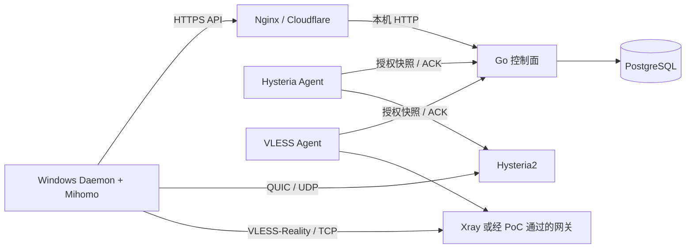

# Lightflow 服务端 MVP 重新设计与改进计划

状态：待 PoC 验证的实施方案。依据 `Lightflow MVP 纠偏.md`，聚焦邀请制 Windows 内测；不把原 `TECHNICAL_DESIGN.md` 中的商业版 V1 范围当作 MVP 上线条件。

## 1. 目标与边界

服务端只为 Windows 用户完成“登录、获取授权、Hysteria2 连接、UDP 不可用时自动改走 VLESS-Reality、断开与撤销”提供必要能力。先利用现有控制面、PostgreSQL 事务配额、设备签名、单管理员后台和已验证的 Hysteria2 Agent。MVP 的服务端新增项限定为 VLESS-Reality TCP 入口、第二国家节点的安全控制通道，以及现有客户端契约的兼容修正。

不新增 OIDC、Redis、RBAC、支付、Artifact Service、多候选评分、服务端自建客户端更新平台或通用遥测平台。现有签名文档接口可以保留，但冻结扩展；整理一次性脚本不作为连接闭环的前置任务。注册和找回密码暂不提供，内测账号由管理员创建。

Windows TUN/DNS/网络恢复原型是服务端 TCP 回退开发的前置事实基础。在 M0′ 证明客户端能够使用现有 Hysteria2 网关以前，不因抽象设计而大改控制面。原 `TECHNICAL_DESIGN.md` 应在方案获验证后把 MVP 边界、邮箱密码、仅 PostgreSQL、单候选和外部 HTTPS 回写到正文；既有 V1 章节标成后续目标。

## 2. 最小架构

- 一个协议入口对应一个 `endpoint`，声明国家、协议、外部地址、端口、健康与容量。Hysteria2 和 VLESS 可以位于同一主机，但分别使用自己的 Agent 身份和监听端口。控制面继续只做授权，不转发用户流量。
- Hysteria2 进程、授权快照与踢线逻辑维持原状。新协议先用独立适配器/进程实现，避免把已验证的 UDP 网关整体替换。是否合并为单一网关程序取决于 PoC 的动态用户与活动连接管理结果，而不是部署外观。
- 初选 Xray 作为 **PoC 候选**：官方 HandlerService 支持给 VLESS 入站增删用户；这只证明动态配置能力，**不证明删除用户会结束现有 TCP 流**。[Xray API](https://xtls.github.io/en/config/api.html)；[REALITY 参数](https://xtls.github.io/en/config/transports/reality.html)。管理 API 仅在网关容器内监听回环地址。可对照 sing-box 测试，只有真实断流、到期、隔离和 Mihomo 兼容均通过的实现才能进入 MVP。

## 3. 授权、回退与 API

保持账户令牌、设备 Ed25519 证明、PG 并发额度、幂等建会话和租约状态机。最小改动是让 `endpoints.protocol` 支持 `hysteria2`、`vless-reality`，并让建会话按客户端声明的协议过滤入口；候选只返回选中的**一个**入口。Hysteria2 响应结构不变，VLESS 候选增添协议所需的公开连接参数，私钥和网关管理地址绝不下发。DB 迁移应采用兼容扩展，现有节点、租约和凭据继续有效。

Windows 客户端先以 `protocols:["hysteria2"]` 建会话。真实 UDP 拨号失败时，先幂等释放该租约，再用**新幂等键**请求 `protocols:["vless-reality"]`；不回退到用户手选国家之外的节点。API 可用但 UDP 不通的场景应自动完成这一过程。这样继续使用“一设备一个活动会话”和单候选计划，无须在 MVP 引入多候选并行授权、评分或无缝切换。释放失败时重试或明确报错，不能绕过配额私自创建第二个会话。

VLESS 凭据提议按“设备身份 + 凭据版本”生成，并只在设备拥有有效租约时安装到选中网关；断开、撤销、到期后立即移除，必要时提升版本以使旧值失效。网关不能仅靠 UUID 存在与否判断订阅权益，Agent 仍按服务端租约截止时间本地执行到期。**这项设计以活动连接能被按设备可靠切断为前提**。若候选网关只能禁止新握手、不能在目标时限内切断已有流，就不得把“每设备凭据 + 轮换”视作已满足撤销要求；必须改选可监管的网关机制或提出明确的需求变更。改成每租约 UUID 也不会自动解决既有流不关闭的问题。

Agent 对每次授权同步先应用到网关，再 ACK 控制面；控制面未获 ACK 不下发可用凭据。同步/监管失败时不得继续发放新授权；已建立流最多维持到最后一次确认的租约截止。VLESS 入口的可用状态必须包含核心存活、动态用户操作和活动连接监管能力，而非仅 TCP 端口可连。

设备签名窗口维持 ±60 秒。先验证公网响应经过 Nginx/Cloudflare 后是否保留可信 `Date` 头，并在客户端做偏移估算与时钟异常提示；只有实测不足时才给控制面加专门时间字段。控制面备用域名由客户端受信 bootstrap 列表与边缘 DNS 配置实现，原则上不新增一套服务端身份系统。

## 4. 第二国家节点与部署边界

第二节点先用 WireGuard 私网连接控制面，继续使用现有私网 HTTP + 每网关独立令牌；内部监听仅绑定隧道地址并限制来源。这样不把 HTTPS/mTLS 实现加进 Agent，也不暴露内部 API 到公网。跨机已有 [独立网关 Compose](../deploy/compose.gateway.yaml) 和 [私网控制端口覆盖](../deploy/compose.private-control.yaml) 可作为起点。每国至少一个可用 Hysteria2 入口；若宣称某国具备 TCP 回退，该国还须有可用 VLESS 入口。

公开控制 API 继续由 Nginx/Cloudflare 终止 HTTPS；管理员路径不经公开主机名转发。Hysteria2 UDP 和 VLESS-Reality TCP 均为客户端直连的协议入口，各自按实际协议配置 DNS、端口和证书/公钥参数。管理后台、数据库和 Agent 内部接口不通过协议入口暴露。

## 5. PoC 与发布门槛

| 验证 | 必须留下的证据 | 未通过时的处理 |
| --- | --- | --- |
| 动态用户 | 不重启整个入口完成增删设备授权；无授权握手被拒绝 | 换网关实现或收缩方案 |
| 真实协议 | Windows Mihomo 与网关完成 VLESS-Reality TCP 建连和传输；UDP 被阻断时自动切换 | 不发布 TCP 回退能力 |
| 现存流撤销 | 建立持续传输后删除设备、撤销订阅、释放租约，观察目标流在 60 秒内结束；旧凭据不能重连 | 不能以“删 UUID”替代踢线；重新选型 |
| 离线到期 | 切断控制面/Agent 通道，验证旧连接不超过最后确认的租约期限，且不产生新授权 | 改造本地强制到期或停止发布 |
| 配额与故障 | 并发建会话不超额；释放失败不偷偷建立第二连接；网关崩溃、重启后与控制面一致 | 先修正确性再开放内测 |
| 跨机 | WireGuard 断开、令牌失效、时钟偏差、第二国家节点恢复均按预期降级 | 保持单机内测，不开放第二国家 |

真实 Xray API 是否能够按设备中断现存流是**未验证假设**，而不是已选定的实现能力。PoC 必须固定网关二进制版本、保存配置样本、请求日志的脱敏摘要和测试结果，避免将实验结果泛化到所有版本。

## 6. 执行计划

1. **冻结与对齐（M0′ 并行，约 1–2 天）**：冻结控制面/后台的新功能；明确 Windows 原型所需的当前 API；把总体设计正文中的服务端现状改为邮箱密码、PG、单候选和现有 Agent 通道。记录与原 PRD 的协议范围变更，交项目负责人确认。
2. **VLESS 网关 PoC（约 3–5 天）**：用隔离环境比较 Xray/必要时 sing-box 的动态授权、活动流撤销、到期、REALITY 参数及 Mihomo 互通。PoC 失败即停在设计阶段，不先改生产 DB。
3. **最小服务端接入（PoC 通过后，约 4–7 天）**：做兼容 DB 迁移、协议过滤、VLESS 单候选响应和独立 Agent/网关适配；复用账户、设备、配额、会话生命周期；补契约与真实长连接回归。旧客户端继续只看到 Hysteria2。
4. **客户端自动回退联调（与 Windows M2′ 同步）**：人为阻断 UDP，测“释放 Hysteria 租约 → 新建 VLESS 租约 → 建连 → 激活 → 续租 → 断开”；检查总耗时和错误提示。此阶段才考虑调优超时，不做评分体系。
5. **第二国家节点与内测（M3′）**：基于 WireGuard 部署独立 Agent；演练私网断联和令牌轮换；在 10–50 名邀请用户范围内观察连接成功率与无需手工修复网络的情况。只收集最小化、可关闭的连接结果；崩溃上报可用客户端现成服务，不为此新增控制面平台。

预计时间是排序用的粗略值，受 Windows M0′ 结果与 VLESS 断流 PoC 影响，不是上线承诺。实施时优先交付可验收的纵向切片，每阶段都保留 Hysteria2 生产回退路径；数据库迁移、协议配置和网关进程应能独立回滚。MVP 的完成条件是 Windows 真人完成连接闭环，不能只以服务端接口或容器健康代替。
