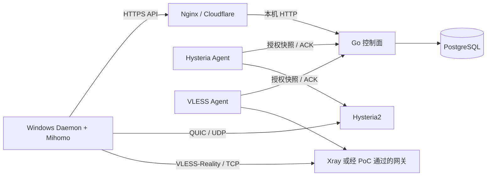

# Lightflow 服务端 MVP 重新设计与改进计划

状态：服务端 MVP 执行基线，VLESS 网关实现仍待限时 PoC。依据 `Lightflow 服务端纠偏.md`，聚焦邀请制 Windows 内测；不把原 `TECHNICAL_DESIGN.md` 中的商业版 V1 范围当作 MVP 上线条件。

## 1. 目标与边界

服务端只为 Windows 用户完成“登录、获取授权、Hysteria2 连接、UDP 不可用时自动改走 VLESS-Reality、断开与撤销”提供必要能力。**眼前第一件事是向 Windows 工作区交付能使用的测试 API、测试账号和 Hysteria2 网关**，并提供人为封锁 UDP 的联调方法。随后才利用现有控制面、PostgreSQL 事务配额、设备签名、单管理员后台和已验证的 Hysteria2 Agent，补充 VLESS-Reality TCP 入口；第二国家节点排在自动回退联调之后。

不新增 OIDC、Redis、RBAC、支付、Artifact Service、多候选评分、服务端自建客户端更新平台或通用遥测平台。现有签名文档接口可以保留，但冻结扩展；整理一次性脚本不作为连接闭环的前置任务。注册和找回密码暂不提供，内测账号由管理员创建。

Windows TUN/DNS/网络恢复原型归客户端负责；服务端负责立即供货和接口联调，不等待客户端原型结束才准备测试环境。总体设计只在顶部标出 MVP 范围，并在每章补一行 MVP 状态；旧 V1 蓝图保留作后续参考，不进行耗时的全文重写。

## 2. 最小架构

- 一个协议入口对应一个 `endpoint`，声明国家、协议、外部地址、端口、健康与容量。Hysteria2 和 VLESS 可以位于同一主机，但分别使用自己的 Agent 身份和监听端口。控制面继续只做授权，不转发用户流量。
- Hysteria2 进程、授权快照与踢线逻辑维持原状。新协议先用独立适配器/进程实现，避免把已验证的 UDP 网关整体替换。是否合并为单一网关程序取决于 PoC 的动态用户与活动连接管理结果，而不是部署外观。
- 初选 Xray 作为 **PoC 候选**：官方 HandlerService 支持给 VLESS 入站增删用户；这只证明动态配置能力，**不证明删除用户会结束现有 TCP 流**。[Xray API](https://xtls.github.io/en/config/api.html)；[REALITY 参数](https://xtls.github.io/en/config/transports/reality.html)。管理 API 仅在网关容器内监听回环地址。可对照 sing-box 测试，只有真实断流、到期、隔离和 Mihomo 兼容均通过的实现才能进入 MVP。

## 3. 授权、回退与 API

保持账户令牌、设备 Ed25519 证明、PG 并发额度、幂等建会话和租约状态机。最小改动是让 `endpoints.protocol` 支持 `hysteria2`、`vless-reality`，并让建会话按客户端声明的协议过滤入口；候选只返回选中的**一个**入口。Hysteria2 响应结构不变，VLESS 候选增添协议所需的公开连接参数，私钥和网关管理地址绝不下发。DB 迁移应采用兼容扩展，现有节点、租约和凭据继续有效。

Windows 客户端先以 `protocols:["hysteria2"]` 建会话。真实 UDP 拨号失败时，先幂等释放该租约，再用**新幂等键**请求 `protocols:["vless-reality"]`；不回退到用户手选国家之外的节点。API 可用但 UDP 不通的场景应自动完成这一过程。这样继续使用“一设备一个活动会话”和单候选计划，无须在 MVP 引入多候选并行授权、评分或无缝切换。释放失败时重试或明确报错，不能绕过配额私自创建第二个会话。

VLESS 凭据提议按“设备身份 + 凭据版本”生成，并只在设备拥有有效租约时安装到选中网关；断开、撤销、到期后立即移除，必要时提升版本以使旧值失效。网关不能仅靠 UUID 存在与否判断订阅权益，Agent 仍按服务端租约截止时间本地执行到期。PoC 限时 **3 天**，优先尝试按用户定位现存连接并切断；仅按源 IP 使用 `ss -K` 或 conntrack 时必须测试共享 NAT 下两个用户是否互相误伤。如果做不到 60 秒踢线，MVP 可以接受经负责人确认的较短 VLESS 租约（例如 300 秒）与相应撤销延迟，**但必须用持续 TCP 流实测并确保这个上界**。删除 UUID 只会阻止新握手，不能凭租约字段本身保证已建立的流到期断开；若无可执行的流生命周期上界，应在需求变更记录中如实说明，不能宣称“撤销延迟 ≤ 租约时长”。

Agent 对每次授权同步先应用到网关，再 ACK 控制面；控制面未获 ACK 不下发可用凭据。同步/监管失败时不得继续发放新授权；已建立流最多维持到最后一次确认的租约截止。VLESS 入口的可用状态必须包含核心存活、动态用户操作和活动连接监管能力，而非仅 TCP 端口可连。

设备签名窗口维持 ±60 秒。先验证公网响应经过 Nginx/Cloudflare 后是否保留可信 `Date` 头，并在客户端做偏移估算与时钟异常提示；只有实测不足时才给控制面加专门时间字段。控制面备用域名由客户端受信 bootstrap 列表与边缘 DNS 配置实现，原则上不新增一套服务端身份系统。

## 4. 第二国家节点与部署边界

第二节点在 VLESS 自动回退联调之后，用 WireGuard 私网连接控制面，继续使用现有私网 HTTP + 每网关独立令牌；内部监听仅绑定隧道地址并限制来源。这样不把 HTTPS/mTLS 实现加进 Agent，也不暴露内部 API 到公网。跨机已有 [独立网关 Compose](../deploy/compose.gateway.yaml) 和 [私网控制端口覆盖](../deploy/compose.private-control.yaml) 可作为起点。第二国家不是 Windows 首条连接的前置条件；若宣称某国具备 TCP 回退，该国还须有可用 VLESS 入口。

公开控制 API 继续由 Nginx/Cloudflare 终止 HTTPS；管理员路径不经公开主机名转发。Hysteria2 UDP 和 VLESS-Reality TCP 均为客户端直连的协议入口，各自按实际协议配置 DNS、端口和证书/公钥参数。管理后台、数据库和 Agent 内部接口不通过协议入口暴露。

## 5. PoC 与发布门槛

| 验证 | 必须留下的证据 | 未通过时的处理 |
| --- | --- | --- |
| 动态用户 | 不重启整个入口完成增删设备授权；无授权握手被拒绝 | 换网关实现或收缩方案 |
| 真实协议 | Windows Mihomo 与网关完成 VLESS-Reality TCP 建连和传输；UDP 被阻断时自动切换 | 不发布 TCP 回退能力 |
| 现存流撤销 | 建立持续传输后删除设备、撤销订阅、释放租约；记录实际断流时间及同 IP 其他用户是否受影响 | 3 天内无法做到 60 秒踢线，则提交范围变更；不能把删 UUID 当成断流 |
| 离线到期 | 切断控制面/Agent 通道，以持续 TCP 流验证已承诺的最长断流时间，且不产生新授权 | 缩短租约也无法保证现存流到期时，不能声明该上界 |
| 配额与故障 | 并发建会话不超额；释放失败不偷偷建立第二连接；网关崩溃、重启后与控制面一致 | 先修正确性再开放内测 |
| 跨机 | WireGuard 断开、令牌失效、时钟偏差、第二国家节点恢复均按预期降级 | 保持单机内测，不开放第二国家 |

真实 Xray API 是否能够按设备中断现存流是**未验证假设**，而不是已选定的实现能力。PoC 必须固定网关二进制版本、保存配置样本、请求日志的脱敏摘要和测试结果，避免将实验结果泛化到所有版本。PoC 的结论只能是“60 秒内按用户踢线已证实”，或“由负责人签字接受实测上界和限制”；不得用未验证的数值替代结果。

## 6. 执行计划

1. **S0 供货与冻结（1–2 天）**：确认 Windows 可访问的测试 API、测试账号、Hysteria2 网关和证书/SNI；把不含密码的连接参数、`API.md` 路径、生产/测试环境区分以及人为封锁 UDP 的测试步骤交给客户端。冻结后台、策略/制品文档接口和运维脚本的新功能；总体设计只加 MVP 横幅及章节状态。服务端验收点：Windows 能用测试账号取得并使用 Hysteria2 租约。
2. **S1 VLESS 网关 PoC（严格限时 3 天）**：隔离环境测试 Xray 的动态授权、REALITY 参数、Mihomo 互通、活动流撤销和共享 NAT 误伤。形成二选一报告：60 秒踢线已证实；或实测最长断流时间、较短租约及限制，提交需求变更由负责人确认。期间不先改生产 DB。
3. **S2 最小服务端接入（PoC 与变更记录确认后，约 4–7 天）**：做兼容 DB 迁移、协议过滤、VLESS 单候选响应和独立 Agent/网关适配；复用账户、设备、配额、会话生命周期；在 `API.md` 增加“协议回退”顺序、错误码和请求/响应样例。接口契约提交以 `API:` 开头。旧客户端继续只看到 Hysteria2。
4. **◆ 与 Windows 同步联调自动回退**：人为封锁 UDP，测“释放 Hysteria 租约 → 新建 VLESS 租约 → 建连 → 激活 → 续租 → 断开”；由 Windows 记录总耗时和错误提示。此阶段才考虑调优超时，不做评分体系。
5. **S3 第二国家节点**：基于 WireGuard 部署独立 Agent；演练私网断联和令牌轮换。两个国家都能连接后再进入 10–50 人邀请制内测。服务端只看授权延迟、租约数量和网关健康；崩溃上报由客户端选用现成服务，不新增通用遥测平台。

**S0 服务端进度（2026-10-08）：**内网 HTTPS 代理已恢复；独立测试账号保存在未入库的 `.local/windows-s0-account.json`。Linux 侧已验证账号登录、Ed25519 临时设备签名、Hysteria2 网关 ACK、真实 QUIC 隧道传输、激活、租约释放和临时设备删除；内网与生产 API 的 `Date` 头均存在。交付参数和 UDP 阻断步骤见 [Windows S0 联调资料](WINDOWS_LAN.md)。Windows 宿主机能否访问虚拟机仍须由客户端工作区实测，生产账号的完整租约与 Hysteria2 连接也不能由这次内网测试代替。

预计时间是排序用的粗略值，受 Windows M0′ 结果与 VLESS 断流 PoC 影响，不是上线承诺。实施时优先交付可验收的纵向切片，每阶段都保留 Hysteria2 生产回退路径；数据库迁移、协议配置和网关进程应能独立回滚。MVP 的完成条件是 Windows 真人完成连接闭环，不能只以服务端接口或容器健康代替。
