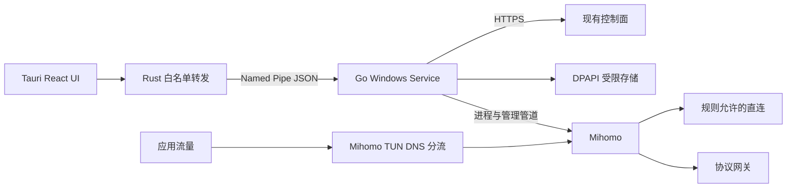

# Windows 客户端 MVP 技术方案

版本：v0.2；2026-10-08。依据《客户端纠错.md》、`REQUIREMENT.md` v0.2、服务端 `docs/API.md`/`docs/openapi.json` 和 `origin/main@7bd2b26` 的 S0 交付。

本文是客户端执行基线；根目录 `TECHNICAL_DESIGN.md` 由服务端维护。相关文档：[执行计划](EXECUTION_PLAN.md)、[最小 Daemon](WINDOWS_DAEMON.md)、[服务端请求](SERVER_REQUESTS.md)。方案完成不代表网络原型通过。

## 1. 目标与当前事实

只做 Windows 11 x64 邀请制内测：安装 → 邮箱密码登录 → 快速连接或选国家 → 实际上网 → 智能/全局分流 → 断开 → 系统网络恢复。先接入现有 Hysteria2，服务端 VLESS-Reality 契约及入口就绪后再联调 TCP 自动回退。用户不输入网关、协议、CA 或配置，也不使用 PowerShell/SCP。

当前桌面仍是模拟状态机；两个启动器只选择环境标签。现有独立 Hysteria2 工具验证过认证与租约，尚无真实 Windows Service、Mihomo TUN、整机分流/恢复证据。Linux S0 测试和后台连接数不能替代 Windows 验收。

## 2. 纠偏后的取舍

| 原方案 | MVP 执行方案 |
| --- | --- |
| 三平台接管、Daemon 自管路由/DNS | Windows 专用实现；由 Mihomo TUN 的自动路由、DNS 与物理接口选择承担接管 |
| 多核心能力矩阵、多候选评分 | 一个 Mihomo 运行器；服务端每次返回一个候选，快速连接选择交给服务端 |
| OIDC、Bridge 保存刷新令牌 | 现有邮箱密码 API；Go 服务用 DPAPI 保存全部令牌和设备密钥 |
| 三档 Kill Switch | 最后实现开/关，明确服务被杀时的保护限制 |
| 核心/规则独立签名更新体系 | 核心、驱动、离线规则随安装包交付，Tauri updater 整包更新 |
| 继续完善演示 UI | 先做 M0′ 手写 Mihomo 配置、真实流量与抓包，再做真实 Daemon/UI |

多平台、其他协议、独立规则/核心更新、复杂评分和持久保护为 V1 待办。本文记录本次纠偏的 MVP 边界，PRD 不由客户端擅自改写，差异交项目负责人汇总。

## 3. 最小架构

UI 负责密码输入、国家、模式、五种连接状态和断开；Rust 只转发，不判断租约或控制核心。Go 负责服务、受限 IPC、身份、API、租约、核心生命周期、探测与重连。Mihomo 负责 TUN、路由、DNS、分流和出站。服务器负责权益、配额、候选和网关授权。

新实现进入 `cmd/lightflow-daemon/`、`internal/client/`，原型工具进入 `apps/desktop/tools/`，文档进入 `docs/client/`。现有客户端目录继续保留，C1 单独迁移；完整归属与历史例外见根 `AGENTS.md`。

## 4. M0′：先跑通网络

不写新 UI/Daemon：脚本读取独立测试账号，生成临时 Ed25519 身份，取得单候选租约，再用手写配置启动 Mihomo。按返回值续租；退出时释放租约、删除临时设备、清理配置。正式客户端持久保存设备身份，普通断开不删除设备。

锁定官方 Mihomo Windows x64 版本、SHA256、驱动和 geosite/geoip 数据版本与许可。本文不预填未经验证的版本。配置/临时凭据只写受精确 ACL 保护的专属 ProgramData 目录，用完删除；不保留原始核心日志。规则离线打包，启动不依赖自动下载。

配置起点为 TUN + `auto-route` + `strict-route` + `auto-detect-interface`，DNS 使用 fake-ip 和 respect-rules。字段及实际行为按固定版本核验，再执行配置检查。Windows 的 strict-route 涉及多网卡 DNS 保护，LAN DNS 劫持仍有边界，必须测试实际 DHCP DNS。[Mihomo TUN](https://wiki.metacubex.one/config/inbound/tun/)、[DNS](https://wiki.metacubex.one/config/dns/)。

智能规则顺序：连接必要端点/bootstrap → 允许的私网 → 国内域名 → 国内 IP → 默认代理。全局模式去掉国内两类 DIRECT，保留连接必需例外。`allow-lan: false` 只限制代理入站，不等于禁止应用访问私网，私网访问设置要通过出站规则实现。直连操作等价于断开，不发租约。

实测 IPv6 接管或拒绝、硬编码 IPv6、无 IPv6 网关、LAN DNS、自带 DoH、fake-ip 网段冲突、强杀后的网卡/路由/DNS、正常断开/唤醒恢复及其他 VPN/Hyper-V 冲突。只关闭 AAAA 不能证明防漏。仅清理能证明归属本产品的对象，不覆盖系统或其他 VPN 策略。

核心管理采用专属 Named Pipe，关闭 TCP 管理入口。官方说明管道接口不校验 `secret`：随机 secret 不能替代 DACL。M0′ 检查固定版本的有效 ACL，并验证未授权本地用户无法读取配置或控制核心；权限不合格则先修复并复测，不能直接给 UI 使用。[Mihomo 管理配置](https://wiki.metacubex.one/config/general/)。

产出 `MIHOMO_BASELINE.md`（验证后的脱敏配置/版本）和 `M0_EVIDENCE.md`（用例、抓包摘要、恢复秒数和限制）。抓包只针对固定测试目标，本机受限保存，不提交原始抓包或用户访问记录。目前两项均未完成，不能预填 PASS。

## 5. 身份、API、租约

云端唯一契约是服务端 `docs/API.md`、`docs/openapi.json`；旧 `contracts/server-api.md` 仅为历史副本。本机 IPC schema 仍放 `contracts/`，真实命令同步 Rust/Go/TS 类型与版本。

邮箱密码登录后读取真实订阅/国家。用户输入密码只短暂传服务，提交后清空；UI 不获得令牌、设备私钥或代理凭据。服务使用 DPAPI 加密存储并设置精确文件 ACL，按 OS 用户、账号和测试/生产环境隔离身份；DPAPI 不能替代文件权限。[Microsoft DPAPI](https://learn.microsoft.com/en-us/windows/win32/api/dpapi/nf-dpapi-cryptprotectdata)。

刷新令牌串行轮换、原子落盘；响应丢失不无限重放旧刷新令牌。API 的 logout 会撤销整个账号所有会话：普通“本机退出登录”释放本机租约、清理本机令牌，保留安全设备身份供重新登录，不静默调用全账户 logout。全账户退出要明确展示影响。

设备证明严格按 API 的五行格式，重试同 body/幂等键但新 nonce/签名。以已验证 HTTPS 的 Date 结合往返时间估算时钟偏移，不修改系统时钟；`INVALID_DEVICE_PROOF` 校正后最多重试一次。响应新鲜度和 ±60 秒窗口必须实测。

连接流程：新键申请 Hysteria2 → pending 按 Retry-After 同键同 body 重试 → 验证单候选/期限 → 生成配置/启动 Mihomo → 经该节点固定 HTTPS 探测 → activate 成功 → UI 显示已连接。探测无直连回退；代理端口可用于转发探测，但还要验证 TUN 应用路径，不能仅凭代理端口成功宣称整机接管。

按 `renew_after_seconds` 调度真实续租，能跨过 15 分钟访问令牌刷新。renew 返回 202 时只使用最后确认截止时间；过期/撤销/失效或截止前未获 ACK 就停止转发，不自行延长。等待使用单调时钟，避免系统时间回拨延长授权。

断开提升 generation，取消授权/探测/重连/续租，停止核心，释放租约并检查恢复。释放失败保留待释放会话并重试，不能创建第二会话绕过配额；恢复失败显示稳定错误和恢复动作，不声称正常断开。

## 6. 回退与重连

服务端 VLESS 契约/入口就绪前只交付 Hysteria2。UDP 相关拨号失败时停止旧核心，确认旧租约释放后用新幂等键申请 `protocols:["vless-reality"]`，保持国家和模式。证书/鉴权/订阅/配置错误不能当作 UDP 被封。VLESS 字段由服务端契约和固定 Mihomo 版本确定，不猜测响应字段。

受控网络目标为 Hysteria2 拨号/探测约 8 秒、释放/申请 VLESS/探测约 12 秒，点击到成功≤20 秒。计时包括授权等待和清理，不能绕过 ACK 达标。默认网关与 DNS 后缀生成本地网络摘要，只在有可靠证据时缓存 UDP 不通 24 小时，不上传原始网络信息。

网络/IP/唤醒事件去抖 1 秒，重连优先有效租约，换候选/协议先释放。退避 1/2/4/8 秒、封顶 30 秒，加抖动；离线等恢复。主动断开、注销、设备撤销或订阅失效取消全部重连，旧 generation 不能发布已连接。

## 7. UI、安装、更新

最小 UI 为登录、真实国家/快速连接、智能/全局、账户摘要、状态与断开。只显示未连接、正在连接、已连接、正在重新连接、连接失败。关闭窗口隐藏到托盘，显式退出/后台连接策略要清晰。服务不可用不回退至模拟成功。

NSIS 包含 UI、服务、固定核心、驱动与离线规则，安装一次 UAC，日常普通用户双击快捷方式。环境配置在服务侧隔离，测试 CA 仅用于显式测试配置，不装系统根；生产正常公共信任。UI 不接受任意 API/core 路径。

Tauri updater 更新整包，服务/核心替换前断开并停止服务，由安装器处理权限，失败保留上一完整包。签名、许可/源码提供和卸载恢复纳入交付。现成崩溃上报可关闭，仅传脱敏版本/错误栈，不传内存转储、配置、秘密或访问历史。

## 8. 最后做 Kill Switch 开/关

开启且有连接意图时，以 WFP 动态会话实现核心失效/重连期间阻断，仅放行回环、必要 DHCP/网络控制、按设置允许的 LAN，以及受限 API/网关/bootstrap 通路。例外不得扩大到任意进程/目的地址。过滤与核心退出之间的竞争窗口用持续流抓包证明；发现进程退出后才加阻断规则不能自动证明零泄漏。

动态会话关闭时清理所属过滤对象，所以服务被强杀、重启前的持久保护不在 MVP 承诺内，UI 和文档明确说明。[Microsoft WFP 会话](https://learn.microsoft.com/en-us/windows/win32/api/fwpmu/nf-fwpmu-fwpmengineopen0)。主动断开/关闭保护恢复网络；未通过实测不开放开关，strict-route 不等同 Kill Switch 验收。

## 9. 当前交付边界

本轮交付独立技术方案、执行计划与共享目录规则，未实现新网络能力。下一步执行 C0/M0′，先用真实 Mihomo 在一台 Windows 跑通，再进入服务与界面实现。新功能是否必要先问：Mihomo 是否已有、内测用户能否感知；不满足时放入 V1 待办。
